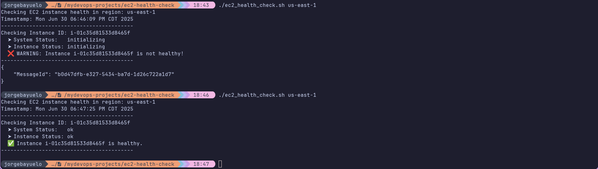
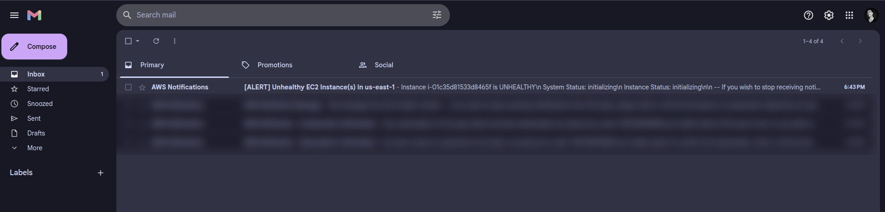
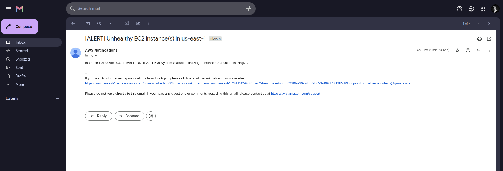

# EC2 Health Check & Alert Script (DevOps PoC)

This proof-of-concept Bash script monitors the health of all running EC2 instances in a specified AWS region. If any instance is in an unhealthy state (based on system or instance status), the script sends an alert via **AWS SNS**.

## 🚀 What It Does

- Queries all running EC2 instances in a given region
- Checks:
  - ✅ System Status (AWS infrastructure)
  - ✅ Instance Status (EC2 OS and network)
- Sends alert via AWS SNS if any instances are unhealthy
- Can be fully automated using `cron`

---

## 📸 Screenshot

